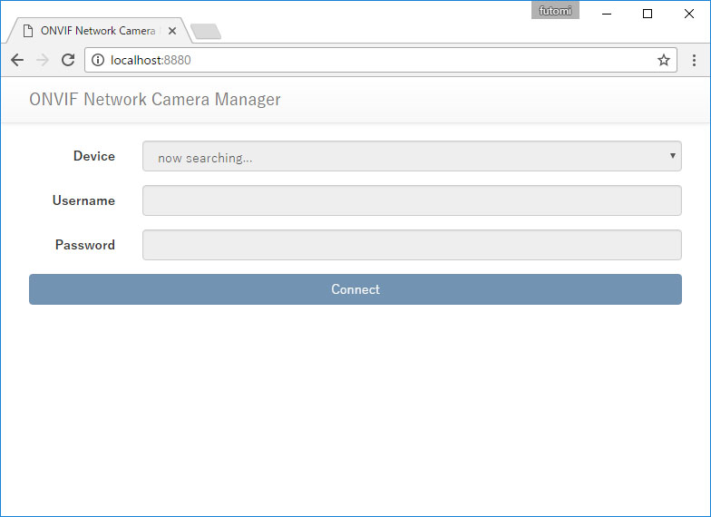

ONVIF Network Camera Manager
===============

The ONVIF Network Camera Manager is a sample application using the [node-onvif](https://github.com/futomi/node-onvif). The ONVIF Network Camera Manger consists of 2 components: a Node.js script `server.js` and a web application.

When the `server.js` is run, it starts a web server and a WebSocket server for the web application. The `server.js` serves the web application of the ONVIF Network Camera Manager to a web browser through HTTP. Then the web application run on the web browser establishes a WebSocket connection in order to communicate with the `server.js` in real time.

When the `server.js` receives a command from the web application run on the web browser, it communicates with the targeted ONVIF device.

You can starts the `server.js` as follows:

```
$ cd {path_of_the_sample_directory}/manager
$ node ./server.js
```

After the `server.js` has been started, you can access the web application accessing `http://localhost:8880` or `http://{the_IP_address_of_the_host}:8880`.

When you can access the web application, you can see the login form as follows:



When the login form is shown, the application starts to discover ONVIF devices. If some devices are found, they will be listed in the select box. Selecting a device in the list, filling the username and the password set to the selected device, and pressing the `Connect` button, you can access the device. If you access the selected device successfully, then you can see the controller page as follows:


If the device supports PTZ, you can pan, tilt, zoom pressing the controls in the screen. You can also control the PTZ feature pressing the keys on the keyboard. The arrow keys are assigned to pan and tilt. The `+` and `-` key are assigned to zoom.

Though the application shows the capture of the camera in real time, it is not a video stream because web browsers does not support any RTP streams. Therefore, the application just shows a snapshot as an image repeatedly in short intervals. The frame rate will be 5 - 10 fps though it depends on the device spec.

Not that the application can not show the camera capture if the device does not support the `GetSnapshotUri` commnad specified in [the ONVIF Media Service Specification](http://www.onvif.org/specs/srv/media/ONVIF-Media-Service-Spec-v1606.pdf).

I tryed some ONVIF network cameras as follows:

- [Panasonic BB-SC384B](http://sol.panasonic.biz/security/netwkcam/lineup/sc384b.html)
  - Though this model is sold in Japan, it seems to be sold in other contries as a different model name, such as WV-SC384 in [United Kingdom](http://business.panasonic.co.uk/security-solutions/products-and-accessories/video-surveillance/ip-security-systems-and-products/network-ptz-dome-security-cameras/wv-sc384?_ga=1.208388497.2069730874.1479653348) and [France](http://business.panasonic.fr/solutions-de-securite/produits-et-accessoires-panasonic-pour-cameras-professionnelles/produits-de-securite/produits-ip/cameras-domes-reseau-ptz/wv-sc384).
  - This application works completely with this model.
- [Sumpple S822](http://www.sumpple.com/enterprise/product/view/13)
  - This model supports both of PTZ and snapshot, but zoom is not supported.
  - PTZ is really slow.
- [DBPOWER Home Surveillance Camera](http://www.dbpow.com/VA0130.html)
  - This model supports snapshot though PTZ is not supported.
